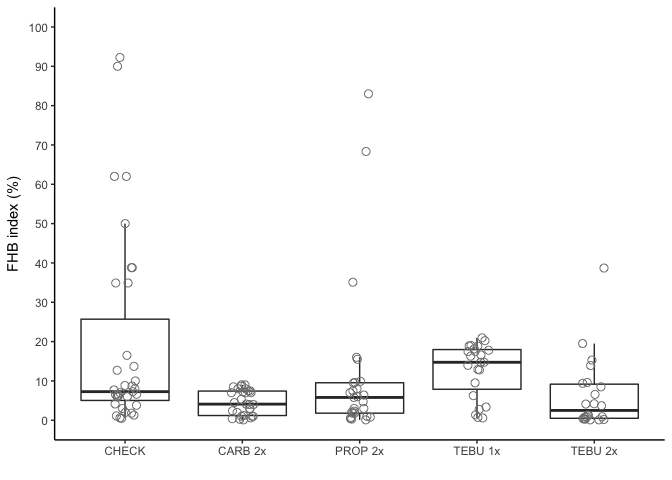
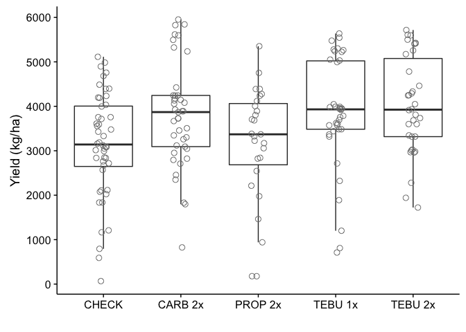

Meta-analysis of fungicide efficacy for FHB control in Brazil
================

Introduction
------------

Import data
-----------

``` r
# import data

# FHB index data
fhb_sev <- read.csv("fhb_sev.csv", sep = ",", h = T)

# Yield data
fhb_yield <- read.csv("fhb_yield.csv", sep = ",", h = T)
```

Prepare variables for meta-analysis
-----------------------------------

### Effect size

``` r
# log of FHB index
fhb_sev$yi <- log(fhb_sev$sev)

# log of yield
fhb_yield$yi <- log(fhb_yield$yield)

# difference in yield between treatment and non-treated check
fhb_yield$D <-fhb_yield$yield - fhb_yield$yield_check

# yield and 
fhb_yield$yi2 <- fhb_yield$yield
```

### Sampling variance

``` r
# Sampling variance for the log of FHB index
fhb_sev$vi <- with(fhb_sev, V_sev / (n * sev^2))

# Sampling variance for the log of yield
fhb_yield$vi <- with(fhb_yield, V_yield / (n * yield^2))

# Sampling variance for yield
fhb_yield$vi2 <- fhb_yield$V_yield/fhb_yield$n # multivariate approach
```

### Create treatment variables

``` r
# Check the number of entries by fungicide (AI: active ingredient) and number of sprays
table(fhb_sev$AI, fhb_sev$n_spray2)
```

    ##          
    ##            0  1  2
    ##   AACHECK 35  0  0
    ##   CARB     0  3 29
    ##   PROP     0  0 27
    ##   TEBU     0 23 22

``` r
# Create treatment variable based on fungicide name and number of sprays 
fhb_sev <- fhb_sev %>% 
  mutate(AI_nspray2 = paste(AI, n_spray2,sep='_')) %>% 
  filter(AI_nspray2 != "CARB_1") %>% 
  filter(trial, length(trial)>1) 

fhb_yield <- fhb_yield %>% 
  mutate(AI_nspray2 = paste(AI, n_spray2,sep='_')) %>% 
  filter(AI_nspray2 != "CARB_1") %>% 
  filter(trial, length(trial)>1) 
```

ID variable for each entry within a trial
-----------------------------------------

``` r
fhb_sev$id <- 1:nrow(fhb_sev)
fhb_yield$id <- 1:nrow(fhb_yield)
```

Descriptive analysis for yield
------------------------------

``` r
# Number of entries by fungicide and number of sprays
kable(table(fhb_yield$AI, fhb_yield$n_spray2), format="pandoc")
```

|         |    0|    1|    2|
|---------|----:|----:|----:|
| AACHECK |   48|    0|    0|
| CARB    |    0|    0|   41|
| PROP    |    0|    0|   27|
| TEBU    |    0|   38|   34|

``` r
# Number of unique trials
length(unique(fhb_yield$trial))
```

    ## [1] 48

``` r
# Number of unique studies
length(unique(fhb_yield$study))
```

    ## [1] 15

``` r
# Number of trial by year
fhb_trial <- fhb_yield %>% 
  group_by(trial) %>% 
  filter(row_number() ==1)

kable(data.frame(table(fhb_trial$year)), format="pandoc")
```

| Var1 |  Freq|
|:-----|-----:|
| 2000 |     4|
| 2004 |     1|
| 2005 |     1|
| 2007 |     1|
| 2009 |     1|
| 2010 |     1|
| 2011 |     7|
| 2012 |     6|
| 2013 |    17|
| 2014 |     9|

``` r
nrow(table(fhb_trial$year))
```

    ## [1] 10

``` r
# Number of trial by location
kable(data.frame(table(fhb_trial$location)), format="pandoc")
```

| Var1                |  Freq|
|:--------------------|-----:|
| Agua Santa          |     1|
| Capao Bonito do Sul |     2|
| Castro              |     1|
| Condor              |     1|
| Coxilha             |    12|
| Cruz Alta           |     6|
| Girua               |     2|
| Guarapuava          |     5|
| Itapiranga          |     1|
| Lages               |     2|
| Londrina            |     1|
| Muitos Capoes       |     1|
| Passo Fundo         |     8|
| Ponta Grossa        |     3|
| Ponta Grossa        |     1|
| Toledo              |     1|

``` r
nrow(table(fhb_trial$location))#Ponta Grossa repete (??)
```

    ## [1] 16

``` r
# Number of trial by publication
kable(data.frame(table(fhb_trial$publication)), format="pandoc")
```

| Var1    |  Freq|
|:--------|-----:|
| Artigo  |     7|
| Boletim |    24|
| Resumo  |    17|

``` r
# Number of trial by state
kable(data.frame(table(fhb_trial$state)), format="pandoc")
```

| Var1 |  Freq|
|:-----|-----:|
| PR   |    11|
| RS   |    34|
| SC   |     3|

``` r
# entries with D value lower than zero
negat_D <- fhb_yield %>% 
  filter(D < 0)
```

Calculate coefficient of variation of FHB index and yield
---------------------------------------------------------

``` r
# CV for FHB index
## All entries
cv <- (sd(fhb_sev$sev)/mean(fhb_sev$sev))*100
cv
```

    ## [1] 148.6624

``` r
## Only non-treated check
cv <- (sd(fhb_sev$sev_check)/mean(fhb_sev$sev_check))*100
cv
```

    ## [1] 122.4901

``` r
### CV for yield

## All entries
cv <- (sd(fhb_yield$yield)/mean(fhb_yield$yield))*100
cv
```

    ## [1] 34.62744

``` r
## For control
cv <- (sd(fhb_yield$yield_check)/mean(fhb_yield$yield_check))*100
cv
```

    ## [1] 34.42881

Network meta-analysis
---------------------

### Mean log of FHB index

``` r
fhb_mv_AI <- rma.mv(yi, vi, 
                    mods = ~ AI_nspray2, 
                    method="ML",
                    random = list(~ AI_nspray2 | trial, ~1 | id), 
                    struct="UN", data=fhb_sev)

# Linear contrasts between pairs of treatments
anova(fhb_mv_AI, L=rbind(c(0,1,-1,0,0), 
                         c(0,0,-1,1,0),
                         c(0,0,-1,0,1),
                         c(0,0,0,-1,1)))  
```

    ## 
    ## Hypotheses:                                           
    ## 1:  AI_nspray2CARB_2 - AI_nspray2PROP_2 = 0
    ## 2: -AI_nspray2PROP_2 + AI_nspray2TEBU_1 = 0
    ## 3: -AI_nspray2PROP_2 + AI_nspray2TEBU_2 = 0
    ## 4: -AI_nspray2TEBU_1 + AI_nspray2TEBU_2 = 0
    ## 
    ## Results:
    ##    estimate     se    zval   pval
    ## 1:  -0.1677 0.0852 -1.9675 0.0491
    ## 2:  -0.2466 0.1315 -1.8755 0.0607
    ## 3:  -0.1271 0.0752 -1.6907 0.0909
    ## 4:   0.1194 0.1100  1.0860 0.2775

Control efficacy
----------------

Back-transform (exponential) the difference of the logs to obtain the response ratio and further calculate the percent reduction in FHB index relative to the check treatment (control efficacy) for each fungicide.

``` r
results_AI <- data.frame(cbind((1-exp(fhb_mv_AI$b))*100, 
                              (1-exp(fhb_mv_AI$ci.lb))*100,
                              (1-exp(fhb_mv_AI$ci.ub))*100))
results_AI
```

    ##                          X1         X2          X3
    ## intrcpt          -778.88805 -465.80272 -1265.21827
    ## AI_nspray2CARB_2   55.07284   65.30548    41.82223
    ## AI_nspray2PROP_2   46.86973   56.29554    35.41104
    ## AI_nspray2TEBU_1   58.47913   67.52944    46.90627
    ## AI_nspray2TEBU_2   53.21278   60.68888    44.31490

Inconsistency test
------------------

Moderator variables
-------------------

### FHB index base

``` r
# create the binary variable (dis_press)
fhb_sev$dis_press <- ifelse(as.numeric(fhb_sev$sev_check) >7.0, 2, 1)

# summarize number of trials per category of dis_press
table(fhb_sev$AI_nspray2, fhb_sev$dis_press)
```

    ##            
    ##              1  2
    ##   AACHECK_0 17 18
    ##   CARB_2    19 10
    ##   PROP_2    15 12
    ##   TEBU_1     4 19
    ##   TEBU_2    10 12

``` r
# Test effect of moderator 
fhb_mv_AI_sev_check <- rma.mv(yi, vi, 
                              mods = ~ AI_nspray2*factor(dis_press),
                              method="ML",
                              random = list(~ AI_nspray2 | trial, ~1 | id),
                              struct="UN", 
                              data=fhb_sev)


# Contrast levels of moderators
anova(fhb_mv_AI_sev_check,btt=7:10)
```

    ## 
    ## Test of Moderators (coefficient(s) 7,8,9,10): 
    ## QM(df = 4) = 6.5407, p-val = 0.1622

### Yield base

``` r
# create binary variable (yield_class)
summary(fhb_sev$yield_check) # Median = 2993; Mean = 2915
```

    ##    Min. 1st Qu.  Median    Mean 3rd Qu.    Max. 
    ##   67.33 2673.00 3085.00 3012.00 3610.00 4984.00

``` r
fhb_sev$yield_class <- ifelse(fhb_sev$yield_check > 3000, 2, 1)

# check number of trials per yield_class category
table(fhb_sev$yield_class, fhb_sev$AI_nspray2)
```

    ##    
    ##     AACHECK_0 CARB_2 PROP_2 TEBU_1 TEBU_2
    ##   1        16     10     12     11     10
    ##   2        19     19     15     12     12

``` r
# test the effect of moderator
fhb_mv_AI_yield_class <- rma.mv(yi, vi, 
                                mods = ~ AI_nspray2*factor(yield_class),
                                method="ML",
                                random = list(~ AI_nspray2 | trial, ~1 | id), 
                                struct="UN", 
                                data=fhb_sev)

anova(fhb_mv_AI_yield_class, btt=7:10) 
```

    ## 
    ## Test of Moderators (coefficient(s) 7,8,9,10): 
    ## QM(df = 4) = 5.5750, p-val = 0.2332

### Year as continuous

``` r
# Moderator year (continuous)
# Number of entries by fungicide and year
table(fhb_sev$AI_nspray2, fhb_sev$year)
```

    ##            
    ##             2000 2004 2005 2007 2010 2011 2012 2013 2014
    ##   AACHECK_0    4    1    1    1    1    7    6    9    5
    ##   CARB_2       0    0    0    0    0    7    5   16    1
    ##   PROP_2       0    0    0    0    0    7    6    8    6
    ##   TEBU_1      16    3    1    1    1    0    0    1    0
    ##   TEBU_2       4    0    0    0    0   14    0    0    4

``` r
fhb_mv_AI_year <- rma.mv(yi, vi, 
                         mods = ~ AI_nspray2*as.numeric(year), 
                         method="ML",
                         random =list(~ AI_nspray2 | trial, ~1 | id),
                         struct="UN", 
                         data=fhb_sev)


anova(fhb_mv_AI_year, btt=7:10)
```

    ## 
    ## Test of Moderators (coefficient(s) 7,8,9,10): 
    ## QM(df = 4) = 6.8229, p-val = 0.1456

### Overall percent yield increase by treament

``` r
### AI_nspray2 (AI and number of sprays)

fhb_mv_AI <- rma.mv(yi, vi, 
                    mods = ~ AI_nspray2, 
                    method="ML",random = list(~ AI_nspray2 | trial, ~1 | id), 
                    struct="UN", data=fhb_yield)
```

    ## Warning in rma.mv(yi, vi, mods = ~AI_nspray2, method = "ML", random =
    ## list(~AI_nspray2 | : Some combinations of the levels of the inner factor
    ## never occurred. Corresponding 'rho' value(s) fixed to 0.

``` r
summary(fhb_mv_AI)
```

    ## 
    ## Multivariate Meta-Analysis Model (k = 188; method: ML)
    ## 
    ##    logLik   Deviance        AIC        BIC       AICc  
    ##  138.7104   596.6813  -237.4208  -172.6920  -232.3909  
    ## 
    ## Variance Components: 
    ## 
    ##             estim    sqrt  nlvls  fixed  factor
    ## sigma^2    0.0000  0.0024    188     no      id
    ## 
    ## outer factor: trial      (nlvls = 48)
    ## inner factor: AI_nspray2 (nlvls = 5)
    ## 
    ##             estim    sqrt  k.lvl  fixed      level
    ## tau^2.1    0.3782  0.6149     48     no  AACHECK_0
    ## tau^2.2    0.4160  0.6450     41     no     CARB_2
    ## tau^2.3    0.3533  0.5944     27     no     PROP_2
    ## tau^2.4    0.2844  0.5333     38     no     TEBU_1
    ## tau^2.5    0.2987  0.5465     34     no     TEBU_2
    ## 
    ##            rho.AACH  rho.CARB  rho.PROP  rho.TEBU_1  rho.TEBU_2    AACH
    ## AACHECK_0         1    0.9914    0.9890      0.9861      0.9805       -
    ## CARB_2       0.9914         1    0.9990      0.9993      0.9975      33
    ## PROP_2       0.9890    0.9990         1      0.0000      0.9985      26
    ## TEBU_1       0.9861    0.9993    0.0000           1      0.9991      22
    ## TEBU_2       0.9805    0.9975    0.9985      0.9991           1      25
    ##            CARB  PROP  TEBU_1  TEBU_2
    ## AACHECK_0    no    no      no      no
    ## CARB_2        -    no      no      no
    ## PROP_2       21     -     yes      no
    ## TEBU_1       12     0       -      no
    ## TEBU_2       20    11      14       -
    ## 
    ## Test for Residual Heterogeneity: 
    ## QE(df = 183) = 14956.8086, p-val < .0001
    ## 
    ## Test of Moderators (coefficient(s) 2,3,4,5): 
    ## QM(df = 4) = 84.8828, p-val < .0001
    ## 
    ## Model Results:
    ## 
    ##                   estimate      se     zval    pval   ci.lb   ci.ub     
    ## intrcpt             7.9375  0.0891  89.0957  <.0001  7.7629  8.1121  ***
    ## AI_nspray2CARB_2    0.1202  0.0159   7.5520  <.0001  0.0890  0.1514  ***
    ## AI_nspray2PROP_2    0.1482  0.0173   8.5882  <.0001  0.1144  0.1820  ***
    ## AI_nspray2TEBU_1    0.1599  0.0216   7.3904  <.0001  0.1175  0.2023  ***
    ## AI_nspray2TEBU_2    0.1758  0.0222   7.9333  <.0001  0.1324  0.2193  ***
    ## 
    ## ---
    ## Signif. codes:  0 '***' 0.001 '**' 0.01 '*' 0.05 '.' 0.1 ' ' 1

``` r
results_I<- data.frame(cbind((exp(fhb_mv_AI$b)-1)*100, 
                             (exp(fhb_mv_AI$ci.lb)-1)*100,
                             (exp(fhb_mv_AI$ci.ub)-1)*100))

results_I
```

    ##                            X1           X2           X3
    ## intrcpt          279925.38239 2.350606e+05 333349.65920
    ## AI_nspray2CARB_2     12.77164 9.308158e+00     16.34486
    ## AI_nspray2PROP_2     15.97217 1.211592e+01     19.96106
    ## AI_nspray2TEBU_1     17.33967 1.246772e+01     22.42267
    ## AI_nspray2TEBU_2     19.22402 1.415570e+01     24.51736

``` r
# Linear contrasts between treatments

anova(fhb_mv_AI, L=rbind(c(0,1,-1,0,0), 
                         c(0,0,1,-1,0),
                         c(0,0,1,0,-1),
                         c(0,0,0,-1,1))) 
```

    ## 
    ## Hypotheses:                                           
    ## 1:  AI_nspray2CARB_2 - AI_nspray2PROP_2 = 0
    ## 2:  AI_nspray2PROP_2 - AI_nspray2TEBU_1 = 0
    ## 3:  AI_nspray2PROP_2 - AI_nspray2TEBU_2 = 0
    ## 4: -AI_nspray2TEBU_1 + AI_nspray2TEBU_2 = 0
    ## 
    ## Results:
    ##    estimate     se    zval   pval
    ## 1:  -0.0280 0.0131 -2.1298 0.0332
    ## 2:  -0.0117 0.0168 -0.6965 0.4861
    ## 3:  -0.0277 0.0135 -2.0509 0.0403
    ## 4:   0.0159 0.0125  1.2783 0.2011

### Overall absolute yield increase

``` r
### by fungicide treatment

fhb_mv_AI_D <- rma.mv(yi2, vi2,
                      mods = ~ AI_nspray2, 
                      method="ML",random = list(~ AI_nspray2 | trial, ~1 | id),                       struct="UN", 
                      data=fhb_yield, 
                      control = list(optimizer="nlm"))
```

    ## Warning in rma.mv(yi2, vi2, mods = ~AI_nspray2, method = "ML", random =
    ## list(~AI_nspray2 | : Some combinations of the levels of the inner factor
    ## never occurred. Corresponding 'rho' value(s) fixed to 0.

``` r
summary(fhb_mv_AI_D)
```

    ## 
    ## Multivariate Meta-Analysis Model (k = 188; method: ML)
    ## 
    ##     logLik    Deviance         AIC         BIC        AICc  
    ## -1363.9516    564.5622   2767.9032   2832.6320   2772.9331  
    ## 
    ## Variance Components: 
    ## 
    ##             estim    sqrt  nlvls  fixed  factor
    ## sigma^2    0.0000  0.0000    188     no      id
    ## 
    ## outer factor: trial      (nlvls = 48)
    ## inner factor: AI_nspray2 (nlvls = 5)
    ## 
    ##                   estim       sqrt  k.lvl  fixed      level
    ## tau^2.1    1172821.1556  1082.9687     48     no  AACHECK_0
    ## tau^2.2    1649776.5517  1284.4363     41     no     CARB_2
    ## tau^2.3    1513922.4058  1230.4155     27     no     PROP_2
    ## tau^2.4    1298155.3558  1139.3662     38     no     TEBU_1
    ## tau^2.5    1377800.2849  1173.7974     34     no     TEBU_2
    ## 
    ##            rho.AACH  rho.CARB  rho.PROP  rho.TEBU_1  rho.TEBU_2    AACH
    ## AACHECK_0         1    0.9595    0.9533      0.9404      0.9168       -
    ## CARB_2       0.9595         1    0.9984      0.9975      0.9919      33
    ## PROP_2       0.9533    0.9984         1      0.0000      0.9938      26
    ## TEBU_1       0.9404    0.9975    0.0000           1      0.9971      22
    ## TEBU_2       0.9168    0.9919    0.9938      0.9971           1      25
    ##            CARB  PROP  TEBU_1  TEBU_2
    ## AACHECK_0    no    no      no      no
    ## CARB_2        -    no      no      no
    ## PROP_2       21     -     yes      no
    ## TEBU_1       12     0       -      no
    ## TEBU_2       20    11      14       -
    ## 
    ## Test for Residual Heterogeneity: 
    ## QE(df = 183) = 42895.4678, p-val < .0001
    ## 
    ## Test of Moderators (coefficient(s) 2,3,4,5): 
    ## QM(df = 4) = 63.1327, p-val < .0001
    ## 
    ## Model Results:
    ## 
    ##                    estimate        se     zval    pval      ci.lb
    ## intrcpt           3140.0622  157.6673  19.9158  <.0001  2831.0400
    ## AI_nspray2CARB_2   455.7985   64.5791   7.0580  <.0001   329.2257
    ## AI_nspray2PROP_2   497.2890   64.7478   7.6804  <.0001   370.3856
    ## AI_nspray2TEBU_1   456.6366   69.1584   6.6028  <.0001   321.0886
    ## AI_nspray2TEBU_2   558.3048   76.4817   7.2998  <.0001   408.4034
    ##                       ci.ub     
    ## intrcpt           3449.0843  ***
    ## AI_nspray2CARB_2   582.3713  ***
    ## AI_nspray2PROP_2   624.1924  ***
    ## AI_nspray2TEBU_1   592.1845  ***
    ## AI_nspray2TEBU_2   708.2062  ***
    ## 
    ## ---
    ## Signif. codes:  0 '***' 0.001 '**' 0.01 '*' 0.05 '.' 0.1 ' ' 1

``` r
# Linear contrasts between treatments

anova(fhb_mv_AI_D, L=rbind(c(0,1,-1,0,0), 
                         c(0,0,1,-1,0),
                         c(0,0,1,0,-1),
                         c(0,0,0,-1,1)))
```

    ## 
    ## Hypotheses:                                           
    ## 1:  AI_nspray2CARB_2 - AI_nspray2PROP_2 = 0
    ## 2:  AI_nspray2PROP_2 - AI_nspray2TEBU_1 = 0
    ## 3:  AI_nspray2PROP_2 - AI_nspray2TEBU_2 = 0
    ## 4: -AI_nspray2TEBU_1 + AI_nspray2TEBU_2 = 0
    ## 
    ## Results:
    ##    estimate      se    zval   pval
    ## 1: -41.4905 34.4974 -1.2027 0.2291
    ## 2:  40.6524 53.9755  0.7532 0.4514
    ## 3: -61.0158 41.7599 -1.4611 0.1440
    ## 4: 101.6683 48.2911  2.1053 0.0353

### Inconsistency test for yield data

``` r
### Groups were inclued directly in the spreadsheet
table(fhb_yield$cons_group)
```

    ## 
    ##  2  3  4  5  6  7  8  9 
    ## 48 47 39 30 10  5  6  3

``` r
### Model 
fhb_mv_AI_cons <- rma.mv(yi2, vi2, 
                         mods = ~ AI_nspray2 * cons_group, 
                         method="ML",
                         random = ~ AI_nspray2 | trial/cons_group, 
                         struct="UN", data=fhb_yield)

summary(fhb_mv_AI_cons)
```

    ## 
    ## Multivariate Meta-Analysis Model (k = 188; method: ML)
    ## 
    ##     logLik    Deviance         AIC         BIC        AICc  
    ## -1522.6343    881.9277   3071.2686   3113.3424   3073.3606  
    ## 
    ## Variance Components: 
    ## 
    ##                  estim      sqrt  nlvls  fixed
    ## sigma^2.1       0.0026    0.0513      5     no
    ## sigma^2.2  610131.6560  781.1092    154     no
    ## sigma^2.3  610135.6411  781.1118    154     no
    ##                                 factor
    ## sigma^2.1                   AI_nspray2
    ## sigma^2.2             AI_nspray2/trial
    ## sigma^2.3  AI_nspray2/trial/cons_group
    ## 
    ## Test for Residual Heterogeneity: 
    ## QE(df = 178) = 31025.5225, p-val < .0001
    ## 
    ## Test of Moderators (coefficient(s) 2,3,4,5,6,7,8,9,10): 
    ## QM(df = 9) = 45.6361, p-val < .0001
    ## 
    ## Model Results:
    ## 
    ##                               estimate        se     zval    pval
    ## intrcpt                      4207.4600  387.1908  10.8666  <.0001
    ## AI_nspray2CARB_2             1117.6093  847.0772   1.3194  0.1870
    ## AI_nspray2PROP_2             -180.3983  674.6374  -0.2674  0.7892
    ## AI_nspray2TEBU_1              825.6867  682.4619   1.2099  0.2263
    ## AI_nspray2TEBU_2              783.8948  596.5568   1.3140  0.1888
    ## cons_group                   -279.0646   90.7879  -3.0738  0.0021
    ## AI_nspray2CARB_2:cons_group  -233.8480  268.4444  -0.8711  0.3837
    ## AI_nspray2PROP_2:cons_group    99.0119  150.4594   0.6581  0.5105
    ## AI_nspray2TEBU_1:cons_group   -10.0297  172.6707  -0.0581  0.9537
    ## AI_nspray2TEBU_2:cons_group    35.6920  139.6539   0.2556  0.7983
    ##                                   ci.lb      ci.ub     
    ## intrcpt                       3448.5800  4966.3401  ***
    ## AI_nspray2CARB_2              -542.6315  2777.8501     
    ## AI_nspray2PROP_2             -1502.6632  1141.8667     
    ## AI_nspray2TEBU_1              -511.9142  2163.2875     
    ## AI_nspray2TEBU_2              -385.3350  1953.1246     
    ## cons_group                    -457.0055  -101.1236   **
    ## AI_nspray2CARB_2:cons_group   -759.9894   292.2935     
    ## AI_nspray2PROP_2:cons_group   -195.8831   393.9069     
    ## AI_nspray2TEBU_1:cons_group   -348.4580   328.3986     
    ## AI_nspray2TEBU_2:cons_group   -238.0246   309.4086     
    ## 
    ## ---
    ## Signif. codes:  0 '***' 0.001 '**' 0.01 '*' 0.05 '.' 0.1 ' ' 1

``` r
results_I<- data.frame(cbind((exp(fhb_mv_AI$b)-1)*100, 
                             (exp(fhb_mv_AI$ci.lb)-1)*100,
                             (exp(fhb_mv_AI$ci.ub)-1)*100))
results_I
```

    ##                            X1           X2           X3
    ## intrcpt          279925.38239 2.350606e+05 333349.65920
    ## AI_nspray2CARB_2     12.77164 9.308158e+00     16.34486
    ## AI_nspray2PROP_2     15.97217 1.211592e+01     19.96106
    ## AI_nspray2TEBU_1     17.33967 1.246772e+01     22.42267
    ## AI_nspray2TEBU_2     19.22402 1.415570e+01     24.51736

``` r
#anova(fhb_mv_AI_cons, btt=14:26) 
```

Visualize the data
------------------

### Boxplot of severity by treatment

``` r
ggplot(fhb_sev, aes(AI_nspray2, sev))+
  geom_boxplot(size = 0.5, outlier.shape = NA)+ 
  geom_jitter(width=0.1, shape=1, size=2.5, color="gray50")+
  scale_x_discrete(labels=c("CHECK","CARB 2x", "PROP 2x" ,"TEBU 1x","TEBU 2x")) +
  theme_classic()+
  xlab("")+
  ylab("FHB index (%)")+ 
  scale_y_continuous(breaks=c(0, 10,  20,  30, 40, 50, 60, 70, 80, 90, 100), limits=c(0,100))
```



### Boxplot yield

``` r
ggplot(fhb_yield, aes(AI_nspray2, yield))+
  geom_boxplot(size = 0.5, outlier.shape = NA)+ geom_jitter(width=0.1, shape=1, size=2.5, color="gray50")+
  scale_x_discrete(labels=c("CHECK","CARB 2x", "PROP 2x" ,"TEBU 1x","TEBU 2x")) +
  theme_cowplot()+
  xlab("")+
  ylab("Yield (kg/ha)")+
  scale_y_continuous(breaks=c(0, 1000,  2000, 3000, 4000, 5000, 6000))
```



### Plot D

``` r
library(plyr)
fhb_yield$se <- sqrt(fhb_yield$vi2/sqrt(fhb_yield$n))

sum<-ddply(.data=fhb_yield, 
               .(AI_nspray2), 
               summarize, 
               n=paste("n =", length(AI_nspray2)))
sum1<-sum %>% filter(AI_nspray2 != "AACHECK_0", AI_nspray2!="PROP_2",AI_nspray2 !="TEBU_1",AI_nspray2 !="TEBU_2")


##### CARB ########

plot_D_carb <- fhb_yield %>% group_by(trial) %>% filter(AI_nspray2 != "AACHECK_0", AI_nspray2!="PROP_2",AI_nspray2 !="TEBU_1",AI_nspray2 !="TEBU_2") %>% 
  ggplot(., aes(reorder(treatment, D), D)) +
  geom_bar(stat="identity")+
  geom_errorbar(width=0.5, size= 0.3, aes(ymax = D + se, ymin=D - se))+
  geom_text(data=sum1, aes(x=5, y=1200,label=n), inherit.aes=FALSE, parse=FALSE)+
  geom_text(aes(x=5, y=1400,label="CARB 2x"), inherit.aes=FALSE, parse=FALSE)+
  geom_hline(aes(yintercept=0), size = 0.1)+
  scale_y_continuous(breaks=c(-250,0, 250,  500, 750, 1000, 1250, 1500))+
  ylab("D (kg/ha)")+ xlab("Study treatments (sorted) ") +
  theme(axis.text = element_text(size=11),
        #axis.title.x=element_blank(), 
        #axis.ticks.x=element_blank(),
        axis.text.x=element_blank(),
        legend.position="none")

######PROP######

sum2<-sum %>% filter(AI_nspray2 != "AACHECK_0", AI_nspray2!="CARB_2",AI_nspray2 !="TEBU_1",AI_nspray2 !="TEBU_2")

plot_D_prop <- fhb_yield %>% group_by(trial) %>% filter (AI_nspray2 != "AACHECK_0", AI_nspray2!="CARB_2",AI_nspray2 !="TEBU_1",AI_nspray2 !="TEBU_2") %>% 
  ggplot(., aes(reorder(treatment, D), D)) +
  geom_bar(stat="identity")+
  geom_errorbar(width=0.5, size= 0.3, aes(ymax = D + se, ymin=D - se))+
  geom_text(data=sum2, aes(x=4, y=1200,label=n), inherit.aes=FALSE, parse=FALSE)+
  geom_text(aes(x=4, y=1400,label="PROP 2x"), inherit.aes=FALSE, parse=FALSE)+
  geom_hline(aes(yintercept=0), size = 0.1)+
  scale_y_continuous(breaks=c(-250,0, 250,  500, 750, 1000, 1250, 1500))+
  ylab(" ")+ xlab("Study treatments (sorted) ") +
  theme(axis.text = element_text(size=11),
        axis.text.x=element_blank(),
        legend.position="none")


##### TEBU########

sum3<-sum %>% filter(AI_nspray2 != "AACHECK_0", AI_nspray2!="CARB_2",AI_nspray2 !="PROP_2",AI_nspray2 !="TEBU_2")

plot_D_tebu <- fhb_yield %>% group_by(trial) %>% filter (AI_nspray2 != "AACHECK_0", AI_nspray2!="CARB_2",AI_nspray2 !="PROP_2",AI_nspray2 !="TEBU_2") %>% 
  ggplot(., aes(reorder(treatment, D), D)) +
  geom_bar(stat="identity")+
 geom_errorbar(width=0.5, size= 0.3, aes(ymax = D + se, ymin=D - se))+
  geom_text(data=sum3, aes(x=5, y=1300,label=n), inherit.aes=FALSE, parse=FALSE)+
  geom_text(aes(x=5, y=1500,label="TEBU 1x"), inherit.aes=FALSE, parse=FALSE)+
  geom_hline(aes(yintercept=0), size = 0.1)+
  scale_y_continuous(breaks=c(-250,0, 250,  500, 750, 1000, 1250, 1500))+
  ylab("D (kg/ha)")+ xlab("Study treatments (sorted) ") +
  labs(fill="Number of sprays" )+
    theme(axis.text = element_text(size=11),
        axis.text.x=element_blank(),
        legend.position="top") 

sum4<-sum %>% filter(AI_nspray2 != "AACHECK_0", AI_nspray2!="CARB_2",AI_nspray2 !="PROP_2",AI_nspray2 !="TEBU_1")

plot_D_tebu2 <- fhb_yield %>% group_by(trial) %>% filter (AI_nspray2 != "AACHECK_0", AI_nspray2!="CARB_2",AI_nspray2 !="PROP_2",AI_nspray2 !="TEBU_1") %>% 
  ggplot(., aes(reorder(treatment, D), D)) +
  geom_bar(stat="identity")+
  geom_errorbar(width=0.5, size= 0.3, aes(ymax = D + se, ymin=D - se))+
  geom_text(data=sum4, aes(x=5, y=1200,label=n), inherit.aes=FALSE, parse=FALSE)+
  geom_text(aes(x=5, y=1400,label="TEBU 2x"), inherit.aes=FALSE, parse=FALSE)+
  geom_hline(aes(yintercept=0), size = 0.1)+
  scale_y_continuous(breaks=c(-250,0, 250,  500, 750, 1000, 1250, 1500))+
  ylab(" ")+ xlab("Study treatments (sorted) ") +
  labs(fill="Number of sprays" )+
    theme(axis.text = element_text(size=11),
        axis.text.x=element_blank(),
        legend.position="top") 

combo1 <- plot_grid(plot_D_carb, plot_D_prop,labels=c('', ''),  ncol = 2)

combo2 <- plot_grid(plot_D_tebu, plot_D_tebu2,labels=c('', ''),  ncol = 2)

plot_grid(combo1, combo2,labels=c('', ''),  ncol = 1)
```


