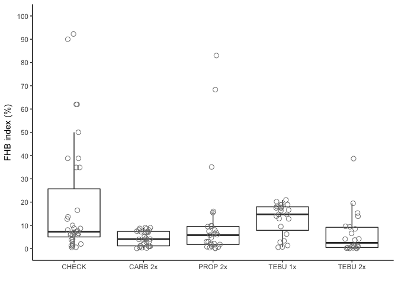

Meta-analysis of fungicide efficacy for FHB control in Brazil
================

Introduction
------------

Import data
-----------

``` r
# import data
fhb_sev <- read.csv("fhb_sev.csv", sep = ",", h =T)
```

Create MA variables
-------------------

### Effect size (yi) and id variable for the treatment

``` r
fhb_sev$yi <- log(fhb_sev$sev)
fhb_sev$id <- 1:nrow(fhb_sev)
```

### Sampling variance (vi)

``` r
fhb_sev$L.var_sev2 <- with(fhb_sev, V_sev/(n * sev^2))
fhb_sev$vi <- fhb_sev$L.var_sev2
```

### Create the fungicide treatment variables

``` r
# Check the number of entries by fungicide (AI: active ingredient) and number of sprays
table(fhb_sev$AI, fhb_sev$n_spray2)
```

    ##          
    ##            0  1  2
    ##   AACHECK 35  0  0
    ##   CARB     0  3 29
    ##   PROP     0  0 27
    ##   TEBU     0 23 22

``` r
# create treatment variable (AI_nspray2) based on fungicide and number of sprays 
fhb_sev <- fhb_sev %>% 
  mutate(AI_nspray2 = paste(AI, n_spray2,sep='_')) %>% 
  filter(AI_nspray2 != "CARB_1") %>% 
  filter(trial, length(trial)>1) 

# four treatments were created with 22 to 35 entries each
table(fhb_sev$AI_nspray2)
```

    ## 
    ## AACHECK_0    CARB_2    PROP_2    TEBU_1    TEBU_2 
    ##        35        29        27        23        22

Calculate coefficient of variation of FHB index
-----------------------------------------------

``` r
## All entries
cv <- (sd(fhb_sev$sev)/mean(fhb_sev$sev))*100
cv
```

    ## [1] 148.6624

``` r
## Only non-treated check
cv <- (sd(fhb_sev$sev_check)/mean(fhb_sev$sev_check))*100
cv
```

    ## [1] 122.4901

Network meta-analysis
---------------------

### Mean log of FHB index

``` r
fhb_mv_AI <- rma.mv(yi, vi, mods = ~ AI_nspray2, method="ML",random = list(~ AI_nspray2 | trial, ~1 | id), struct="UN", data=fhb_sev)
```

    ## Warning in rma.mv(yi, vi, mods = ~AI_nspray2, method = "ML", random =
    ## list(~AI_nspray2 | : Some combinations of the levels of the inner factor
    ## never occurred. Corresponding 'rho' value(s) fixed to 0.

``` r
# Linear contrasts between pairs of treatments
anova(fhb_mv_AI, L=rbind(c(0,1,-1,0,0), 
                         c(0,0,-1,1,0),
                         c(0,0,-1,0,1),
                         c(0,0,0,-1,1)))  
```

    ## 
    ## Hypotheses:                                           
    ## 1:  AI_nspray2CARB_2 - AI_nspray2PROP_2 = 0
    ## 2: -AI_nspray2PROP_2 + AI_nspray2TEBU_1 = 0
    ## 3: -AI_nspray2PROP_2 + AI_nspray2TEBU_2 = 0
    ## 4: -AI_nspray2TEBU_1 + AI_nspray2TEBU_2 = 0
    ## 
    ## Results:
    ##    estimate     se    zval   pval
    ## 1:  -0.1677 0.0852 -1.9675 0.0491
    ## 2:  -0.2466 0.1315 -1.8755 0.0607
    ## 3:  -0.1271 0.0752 -1.6907 0.0909
    ## 4:   0.1194 0.1100  1.0860 0.2775

Control efficacy
----------------

Bback-transforming difference of the logs

``` r
results_AI <- data.frame(cbind((1-exp(fhb_mv_AI$b))*100, 
                              (1-exp(fhb_mv_AI$ci.lb))*100,
                              (1-exp(fhb_mv_AI$ci.ub))*100))
results_AI
```

    ##                          X1         X2          X3
    ## intrcpt          -778.88805 -465.80272 -1265.21827
    ## AI_nspray2CARB_2   55.07284   65.30548    41.82223
    ## AI_nspray2PROP_2   46.86973   56.29554    35.41104
    ## AI_nspray2TEBU_1   58.47913   67.52944    46.90627
    ## AI_nspray2TEBU_2   53.21278   60.68888    44.31490

Inconsistency test
------------------

Moderator variables
-------------------

### FHB index base

``` r
# create the binary variable (dis_press)
fhb_sev$dis_press <- ifelse(as.numeric(fhb_sev$sev_check) >7.0, 2, 1)

# summarize number of trials per category of dis_press
table(fhb_sev$AI_nspray2, fhb_sev$dis_press)
```

    ##            
    ##              1  2
    ##   AACHECK_0 17 18
    ##   CARB_2    19 10
    ##   PROP_2    15 12
    ##   TEBU_1     4 19
    ##   TEBU_2    10 12

``` r
# Test effect of moderator 
fhb_mv_AI_sev_check <- rma.mv(yi, vi, mods = ~ AI_nspray2*factor(dis_press), method="ML",random = list(~ AI_nspray2 | trial, ~1 | id), struct="UN", data=fhb_sev)


# Contrast levels of moderators
anova(fhb_mv_AI_sev_check,btt=7:10)
```

    ## 
    ## Test of Moderators (coefficient(s) 7,8,9,10): 
    ## QM(df = 4) = 6.5407, p-val = 0.1622

### Yield base

``` r
# create binary variable (yield_class)
summary(fhb_sev$yield_check) # Median = 2993; Mean = 2915
```

    ##    Min. 1st Qu.  Median    Mean 3rd Qu.    Max. 
    ##   67.33 2673.00 3085.00 3012.00 3610.00 4984.00

``` r
fhb_sev$yield_class <- ifelse(fhb_sev$yield_check > 3000, 2, 1)

# check number of trials per yield_class category
table(fhb_sev$yield_class, fhb_sev$AI_nspray2)
```

    ##    
    ##     AACHECK_0 CARB_2 PROP_2 TEBU_1 TEBU_2
    ##   1        16     10     12     11     10
    ##   2        19     19     15     12     12

``` r
# test the effect of moderator
fhb_mv_AI_yield_class <- rma.mv(yi, vi, mods = ~ AI_nspray2*factor(yield_class), method="ML",random = list(~ AI_nspray2 | trial, ~1 | id), struct="UN", data=fhb_sev)

anova(fhb_mv_AI_yield_class, btt=7:10) 
```

    ## 
    ## Test of Moderators (coefficient(s) 7,8,9,10): 
    ## QM(df = 4) = 5.5750, p-val = 0.2332

### Year as continuous

``` r
# Moderator year (continuous)
# Number of entries by fungicide and year
table(fhb_sev$AI_nspray2, fhb_sev$year)
```

    ##            
    ##             2000 2004 2005 2007 2010 2011 2012 2013 2014
    ##   AACHECK_0    4    1    1    1    1    7    6    9    5
    ##   CARB_2       0    0    0    0    0    7    5   16    1
    ##   PROP_2       0    0    0    0    0    7    6    8    6
    ##   TEBU_1      16    3    1    1    1    0    0    1    0
    ##   TEBU_2       4    0    0    0    0   14    0    0    4

``` r
fhb_mv_AI_year <- rma.mv(yi, vi, mods = ~ AI_nspray2*as.numeric(year), method="ML",random =list(~ AI_nspray2 | trial, ~1 | id), struct="UN", data=fhb_sev)


anova(fhb_mv_AI_year, btt=7:10)
```

    ## 
    ## Test of Moderators (coefficient(s) 7,8,9,10): 
    ## QM(df = 4) = 6.8229, p-val = 0.1456

Visualize the data
------------------

### Boxplot of severity by treatment

``` r
ggplot(fhb_sev, aes(AI_nspray2, sev))+
  geom_boxplot(size = 0.5, outlier.shape = NA)+ 
  geom_jitter(width=0.1, shape=1, size=2.5, color="gray50")+
  scale_x_discrete(labels=c("CHECK","CARB 2x", "PROP 2x" ,"TEBU 1x","TEBU 2x")) +
  theme_classic()+
  xlab("")+
  ylab("FHB index (%)")+ 
  scale_y_continuous(breaks=c(0, 10,  20,  30, 40, 50, 60, 70, 80, 90, 100), limits=c(0,100))
```


